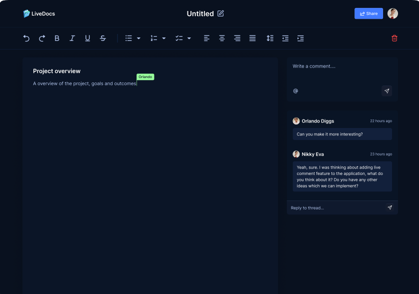

# 📝 Live-Docs

<div align="center">




### ✍️ Real-Time Collaborative Document Platform

Create, edit, comment, and Live-Docs on documents in real time with a seamless multi-user editing experience.

</div>

---

# 📖 Overview

**Live-Docs** is a real-time collaborative document platform inspired by modern online editors.

Users can create, edit, share, and manage documents while collaborating with teammates in real time. Live cursors, threaded comments, notifications, and document permissions provide an intuitive environment for productive teamwork.

---

# ✨ Core Features

## ✍️ Real-Time Collaborative Editing

Live-Docs with multiple users simultaneously.

### Features

- Live document editing
- Instant synchronization
- Multi-user collaboration
- Real-time updates

---

## 📄 Document Management

Manage documents with ease.

### Features

- Create documents
- Edit documents
- Delete documents
- Search documents
- Sort documents

---

## 🔗 Sharing & Permissions

Share documents securely.

### Features

- Share via email
- Shareable links
- View permissions
- Edit permissions

---

## 💬 Comments & Discussions

Collaborate through conversations.

### Features

- Inline comments
- General comments
- Threaded discussions
- Collaborative feedback

---

## 👥 Live Presence

Know who's working with you.

### Features

- Active collaborators
- Live presence indicators
- Real-time user activity

---

## 🔔 Notifications

Stay informed about document activity.

### Features

- Document sharing alerts
- New comment notifications
- Collaboration updates

---

## 🔐 Authentication

Secure user authentication and session management.

### Features

- GitHub Sign-In
- Secure sessions
- Protected access

---

## 📱 Responsive Design

Designed for every device.

### Features

- Mobile-friendly
- Tablet support
- Desktop optimized
- Modern interface

---

# 🛠️ Tech Stack

## ⚛️ Frontend

- Next.js
- React
- TypeScript
- Tailwind CSS

---

## ⚡ Real-Time Collaboration

- Liveblocks

---

## 🔐 Authentication

- Clerk

---

# 🚀 Getting Started

## 1️⃣ Clone the repository

```bash
git clone https://github.com/yourusername/collabspace.git

cd Live-Docs
```

---

## 2️⃣ Install dependencies

```bash
npm install
```

---

## 3️⃣ Configure environment variables

```env
#Clerk
NEXT_PUBLIC_CLERK_PUBLISHABLE_KEY=
CLERK_SECRET_KEY=
NEXT_PUBLIC_CLERK_SIGN_IN_URL=/sign-in
NEXT_PUBLIC_CLERK_SIGN_UP_URL=/sign-up

#Liveblocks
NEXT_PUBLIC_LIVEBLOCKS_PUBLIC_KEY=
LIVEBLOCKS_SECRET_KEY=
```

---

## 4️⃣ Run the application

```bash
npm run dev
```

Open:

```
http://localhost:3000
```

---

# 🔄 System Architecture

```text
           User
             │
             ▼
     Next.js Frontend
             │
             ▼
      Authentication
             │
             ▼
     Live Document Editor
             │
      ┌──────┴──────┐
      ▼             ▼
 Live Collaboration Comments
      │             │
      └──────┬──────┘
             ▼
   Notifications & Presence
```

---

# 🌟 Key Highlights

- ✍️ Real-time collaborative editing
- 👥 Live multi-user presence
- 📄 Document management
- 🔗 Secure document sharing
- 💬 Threaded comments
- 🔔 Real-time notifications
- 🔐 GitHub authentication
- 📱 Responsive design

---

# 💡 What This Project Demonstrates

This project showcases expertise in:

- Real-time collaboration systems
- Full-stack Next.js development
- Multi-user synchronization
- Authentication & authorization
- Collaborative UI/UX design
- Document management
- Scalable web applications

---

# 🚀 Future Improvements

- Version history
- Offline editing
- Rich media support
- Team workspaces
- Export to PDF
- AI writing assistant
- Grammar suggestions
- Mobile application

---

# ❤️ Final Note

Live-Docs delivers a seamless real-time collaboration experience by combining live document editing, secure sharing, threaded discussions, and team presence into one modern productivity platform.

